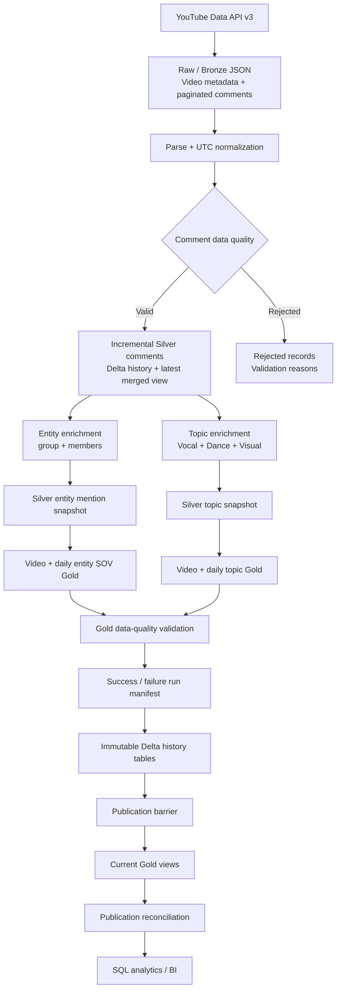

# 📊 YouTube Comment Data Pipeline & Audience Analytics

[](https://github.com/Rselayva/youtube-comment-pipeline/actions/workflows/ci.yml)

Welcome to the **YouTube Comment Data Pipeline & Audience Analytics** project!  
歡迎來到我的 **YouTube 留言資料管線與受眾分析專案**！

This portfolio project demonstrates an end-to-end, scheduled incremental batch pipeline that ingests top-level YouTube comments, preserves raw data, builds validated analytics datasets, and publishes reliable Gold data products for SQL analytics and business intelligence.  
本作品集專案展示一套端到端的排程式增量批次資料管線，負責擷取 YouTube 頂層留言、保存原始資料、建立通過驗證的分析資料集，並發布可靠的 Gold 資料產品供 SQL 分析與商業智慧使用。

The business use case focuses on audience share-of-voice for K-pop group/member mentions and rule-based `vocal`, `dance`, and `visual` topics.   
商業應用聚焦於 K-pop 團體／成員的受眾聲量占比，以及以規則判斷的 `vocal`、`dance`、`visual` 主題分析。

---

## 🚀 Project Overview（專案概述）

This project includes the following data engineering capabilities:  
本專案包含以下資料工程能力：

1. **API Ingestion**: Retrieves video metadata and paginated top-level comments from YouTube Data API v3 with timeout, retry, exponential backoff, and domain-specific error handling.  
   **API 資料擷取**：透過 YouTube Data API v3 取得影片資訊與分頁頂層留言，並實作 timeout、retry、exponential backoff 與領域錯誤分類。

2. **Medallion Architecture**: Organizes data into Raw/Bronze, Silver, Rejected, and Gold datasets with explicit lineage.  
   **獎章式資料架構**：將資料分為 Raw/Bronze、Silver、Rejected 與 Gold 資料集，並保留明確的資料血緣。

3. **Incremental Processing**: Merges comment versions by `comment_id`, `updated_at`, and `ingested_at`, while writing only new or updated Silver deltas.  
   **增量處理**：依 `comment_id`、`updated_at` 與 `ingested_at` 合併留言版本，Silver 僅寫入新增或更新的 delta。

4. **Rule-Based Enrichment**: Uses versioned multilingual dictionaries to identify K-pop group/member mentions and comment topics.  
   **規則式資料豐富化**：使用具版本控制的多語言字典，辨識 K-pop 團體／成員提及與留言主題。

5. **Data Quality**: Validates comment records, rejected-data lineage, Gold schemas, logical keys, counts, ratios, denominators, and snapshot consistency.  
   **資料品質驗證**：驗證留言紀錄、拒絕資料血緣、Gold schema、邏輯鍵、計數、比例、分母及 snapshot 一致性。

6. **Warehouse Publication**: Loads Gold snapshots into DuckDB locally or publishes immutable Delta history tables and current views in Databricks.  
   **資料倉儲發布**：可將 Gold snapshots 載入本機 DuckDB，或發布至 Databricks 的不可變 Delta history tables 與 current views。

7. **Orchestration and CI**: Runs as a two-task daily Databricks Workflow and executes the complete test suite through GitHub Actions.  
   **排程與 CI**：使用兩階段 Databricks Workflow 每日執行，並透過 GitHub Actions 驗證完整測試套件。

---

## 🏗️ Data Architecture（資料架構）

The project follows a scheduled incremental batch architecture rather than a permanently running listener. Each execution processes one finite batch and then exits.  
本專案採用排程式增量批次架構，而不是永久運行的監聽程式。每次執行處理一個有限批次，完成後即結束。



### Bronze Layer（銅層）

Stores complete YouTube API responses without flattening or cleaning. Each file includes a metadata envelope containing the video ID, page number, and UTC ingestion timestamp for lineage.  
完整保存 YouTube API 回應，不進行攤平或清理。每個檔案都包含影片 ID、頁碼與 UTC 擷取時間的 metadata envelope，以保留資料血緣。

### Silver Layer（銀層）

Parses top-level comments into a typed, flat schema; normalizes timestamps to timezone-aware UTC values; separates rejected records; merges comment versions incrementally; and produces versioned entity/topic snapshots.  
將頂層留言解析為具明確型別的扁平 schema、將時間正規化為帶時區的 UTC、分離 rejected records、增量合併留言版本，並產生具版本控制的 Entity／Topic snapshots。

### Gold Layer（金層）

Produces validated video-level and daily share-of-voice metrics. Gold outputs include configured entities and topics with zero mentions so dashboards retain a stable analytical domain.  
產生通過驗證的影片層級與每日聲量占比指標。Gold 也會保留零提及的已設定 Entity 與 Topic，讓 dashboard 維持穩定的分析維度。

### Publication Layer（發布層）

Databricks stores every published run in typed Delta history tables. Current views expose only the newest successfully published run for each video. A dependent reconciliation task verifies publication, history, and view row counts before downstream use.  
Databricks 將每次發布的 run 保存於具明確 schema 的 Delta history tables。Current views 只顯示每支影片最新且成功發布的 run；相依的 reconciliation task 會在下游使用前核對 publication、history 與 view 筆數。

---

## 🔄 Pipeline Execution Flow（管線執行流程）

```text
Video ID / supported YouTube URL
    → video metadata ingestion
    → paginated top-level comment ingestion
    → Raw JSON persistence
    → parsing and UTC normalization
    → valid / rejected split
    → incremental Silver merge
    → entity and topic enrichment
    → video-level and daily Gold metrics
    → Gold validation
    → run manifest
    → Databricks publication
    → publication reconciliation
```

The default workflow processes top-level comments only. It retains `total_reply_count` as an engagement signal without ingesting reply content. Raw reply ingestion exists as an optional Bronze capability but is not connected to the default workflow.  
預設流程只處理頂層留言，保留 `total_reply_count` 作為互動訊號，但不擷取回覆內容。專案具有可選的 Raw reply ingestion 能力，但未接入預設工作流程。

---

## 📈 Analytics Data Products（分析資料產品）

The warehouse publishes four current Gold datasets:  
資料倉儲會發布四個 current Gold 資料集：

| Gold dataset | Grain | Purpose / 用途 |
|---|---|---|
| `gold_video_entity_sov` | One row per video, dictionary version, and entity / 每支影片、字典版本與 Entity 一列 | Compare group/member mention share of voice / 比較團體與成員提及聲量 |
| `gold_daily_entity_sov` | One row per UTC date and entity / 每個 UTC 日期與 Entity 一列 | Analyze entity mention trends / 分析 Entity 每日聲量趨勢 |
| `gold_video_topic_metrics` | One row per video, dictionary version, and topic / 每支影片、字典版本與 Topic 一列 | Compare `vocal`, `dance`, and `visual` topics / 比較三類主題聲量 |
| `gold_daily_topic_metrics` | One row per UTC date and topic / 每個 UTC 日期與 Topic 一列 | Analyze topic trends over time / 分析 Topic 每日趨勢 |

### Entity Metrics（Entity 指標）

The entity dictionary is currently versioned as `nmixx_v2`. A comment contributes at most one mention to each matched group or member, even when the same alias appears repeatedly.  
目前 Entity 字典版本為 `nmixx_v2`。即使同一 alias 在留言中重複出現，一則留言對每個命中的團體或成員最多只貢獻一次提及。

```text
comment_share_of_voice
= mention_comment_count / comment_count

entity_share_of_voice
= mention_comment_count / entity_type_mention_comment_count
```

Group and member denominators are calculated separately. Explicit member mentions do not automatically create group mentions.  
團體與成員的分母分開計算；明確提到成員時，不會自動增加團體提及。

### Topic Metrics（Topic 指標）

The topic dictionary is currently versioned as `comment_topics_v1`. Topic classification is multi-label, so one comment may match multiple topics while contributing at most once to each topic.  
目前 Topic 字典版本為 `comment_topics_v1`。Topic 分類屬於 multi-label，因此同一留言可以命中多個 Topic，但對每個 Topic 最多貢獻一次。

```text
comment_share_of_voice
= topic_comment_count / comment_count

topic_share_of_voice
= topic_comment_count / topic_comment_count_total
```

---

## ✅ Reliability and Data Quality（可靠性與資料品質）

- **Resilient API client**: 30-second timeout, up to three attempts, exponential backoff, and retry only for transient failures.  
  **具韌性的 API client**：30 秒 timeout、最多三次嘗試、指數退避，且只重試暫時性錯誤。
- **Incremental and idempotent processing**: Reprocessing unchanged comments does not create duplicate latest records.  
  **增量與冪等處理**：重新處理未變更的留言不會產生重複的 latest records。
- **Rejected-data lineage**: Invalid records are preserved with validation reasons instead of being silently discarded.  
  **拒絕資料血緣**：無效資料會連同驗證原因保存，而不是被靜默丟棄。
- **Warehouse safety**: DuckDB uses a four-table transaction; Databricks uses immutable history and a publication barrier.  
  **資料倉儲安全性**：DuckDB 使用四表 transaction；Databricks 使用不可變 history 與 publication barrier。

---

## 🛠️ Technology Stack（技術棧）

| Area / 領域 | Technologies / 技術 |
|---|---|
| Language / 語言 | Python 3.12, SQL |
| Source / 來源 | YouTube Data API v3, Requests |
| Local analytics / 本機分析 | DuckDB |
| Cloud data platform / 雲端資料平台 | Databricks, PySpark runtime, Delta Lake, Unity Catalog, Volumes, Secrets |
| Orchestration / 排程 | Databricks Workflows |
| Testing / 測試 | pytest, Mock, integration and architecture tests |
| CI / 持續整合 | GitHub Actions |
| Configuration / 設定 | JSON dictionaries, environment variables, Databricks widgets |

The shared Python modules do not import PySpark or the Databricks SDK. Spark and platform parameters are injected only at the Databricks runtime boundary.  
共用 Python modules 不直接 import PySpark 或 Databricks SDK；Spark 與平台參數只在 Databricks runtime 邊界注入。

---

## 📁 Repository Structure（Repository 結構）

```text
youtube-comment-pipeline/
├── .github/workflows/       # GitHub Actions CI
├── config/                  # Versioned entity and topic dictionaries
├── databricks/              # Pipeline, smoke-test, and validation notebooks
├── docs/                    # Databricks setup and workflow guides
├── sql/                     # Gold table contracts and analytics queries
├── src/
│   ├── ingestion/           # YouTube API client and pagination
│   ├── transformation/      # Parsing, incremental merge, and metrics
│   ├── validation/          # Comment and Gold data-quality rules
│   ├── enrichment/          # Entity and topic classification
│   ├── storage/             # Raw, Silver, Gold, rejected, and manifest I/O
│   └── warehouse/           # DuckDB and Databricks adapters
├── tests/                   # Unit, integration, and architecture tests
├── requirements.txt
└── requirements-duckdb.txt
```

Runtime data is written below `data/` locally or below an injected Unity Catalog Volume root in Databricks. The `data/` directory, local `.env`, and credentials are excluded from Git.  
執行資料在本機寫入 `data/`，或在 Databricks 寫入注入的 Unity Catalog Volume root。所有 `data/`、本機 `.env` 與 credentials 都不會進入 Git。

---

## ▶️ Local Quick Start（本機快速開始）

Install dependencies and configure the YouTube API key:  
安裝相依套件並設定 YouTube API key：

​```bash
python -m pip install -r requirements.txt
​```

​```env
YOUTUBE_API_KEY=your_api_key
​```

Run the pipeline and inspect the result:  
執行 Pipeline 並查看結果：

​```bash
python src/main.py VIDEO_ID --max-pages 2 --page-size 100
python src/run_summary.py VIDEO_ID --latest-successful
​```

For DuckDB and Databricks deployment instructions, see:  
DuckDB 與 Databricks 部署方式請參考：

- `requirements-duckdb.txt`
- `docs/DATABRICKS_WORKFLOW.md`

---

## 🧱 Databricks Deployment（Databricks 部署）

The deployed workflow uses Unity Catalog, a Volume-backed storage root, Databricks Secrets, typed Delta history tables, current views, and a two-task success dependency:  
已部署的 Workflow 使用 Unity Catalog、Volume-backed storage root、Databricks Secrets、具型別的 Delta history tables、current views，以及兩階段成功相依：

```text
run_pipeline
    ↓ on success
validate_publication
```

The daily trigger and failure notification are active. A real end-to-end pipeline run and publication reconciliation have been completed successfully in the development environment.  
每日 trigger 與失敗通知均已啟用，且已在開發環境完成真實端到端 Pipeline 與 publication reconciliation 驗證。

Setup and verification guides / 設定與驗證文件：

- [Databricks Gold Smoke Test](docs/DATABRICKS_SMOKE_TEST.md)
- [Databricks End-to-End Workflow](docs/DATABRICKS_WORKFLOW.md)

Catalog, schema, Volume, and Secret names are runtime parameters rather than hardcoded application values.  
Catalog、schema、Volume 與 Secret 名稱都是 runtime parameters，而不是寫死於應用程式中的值。

---

## 🧪 Testing and Verification（測試與驗證）

```bash
python -m pytest -q
```

Current verified result / 目前驗證結果：

```text
258 passed
```

The tests cover API/domain errors, pagination, parsing, validation, incremental idempotency, entity/topic enrichment, Gold metrics, storage I/O, run manifests, DuckDB transactions, Databricks publication, reconciliation, notebook safety, SQL contracts, and CI contracts.
測試涵蓋 API／domain errors、pagination、parsing、validation、incremental idempotency、Entity／Topic enrichment、Gold metrics、storage I/O、run manifests、DuckDB transactions、Databricks publication、reconciliation、notebook safety、SQL contracts 與 CI contracts。

Unit tests use mocks and temporary directories, so they do not require YouTube credentials, network access, API quota, or a live Databricks workspace. Real Databricks smoke and end-to-end checks are maintained as separate integration verification.
Unit tests 使用 mocks 與暫存目錄，因此不需要 YouTube credentials、網路、API quota 或真實 Databricks workspace。真實 Databricks smoke 與端到端檢查則作為獨立 integration verification。

---

## 🔒 Security and Privacy（安全與隱私）

- API keys are read from a local `.env` or Databricks Secret Scope and are never embedded in job parameters.  
  API key 從本機 `.env` 或 Databricks Secret Scope 讀取，不會放入 Job parameters。
- Request logs never include a complete URL containing credentials.  
  Request logs 不會包含帶有 credentials 的完整 URL。
- Runtime data and real comment content are excluded from Git.  
  執行資料與真實留言內容不會進入 Git。
- Gold datasets contain aggregated analytics and do not expose author names or comment text.  
  Gold 資料集只包含彙總分析，不會暴露作者名稱或留言文字。

---

## 📜 License（授權）

This project is licensed under the [MIT License](LICENSE) and is intended for learning and reference purposes. You may use, modify, and share the project provided that the original license and attribution are retained.  
本專案採用 [MIT 授權條款](LICENSE)，供學習與參考使用。你可以使用、修改與分享本專案，但需保留原始授權與適當標註。

---

## ⭐ About Me（關於我）

Hi, I’m James, a computer programming graduate with a strong interest in data engineering and analytics. I enjoy building end-to-end data solutions—from reliable ingestion and data quality to warehouse publication and meaningful analytics.  
Hi，我是 James，一名程式設計科系畢業生，對資料工程與資料分析有濃厚興趣。我喜歡打造端到端資料解決方案，從可靠的資料擷取與品質驗證，到資料倉儲發布與具意義的分析成果。

I am currently strengthening my skills in Python, SQL, data modeling, Databricks, and production-oriented pipeline design, and I am actively seeking opportunities as a Junior / Entry-Level Data Engineer.  
目前我持續加強 Python、SQL、資料建模、Databricks 與 production-oriented Pipeline 設計能力，並積極尋找 Junior／Entry-Level Data Engineer 的職涯機會。
